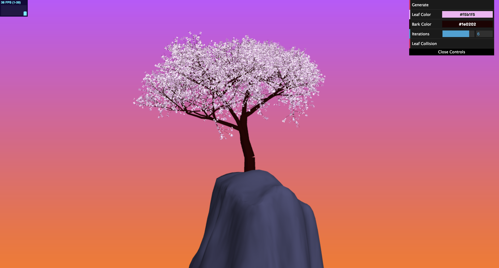
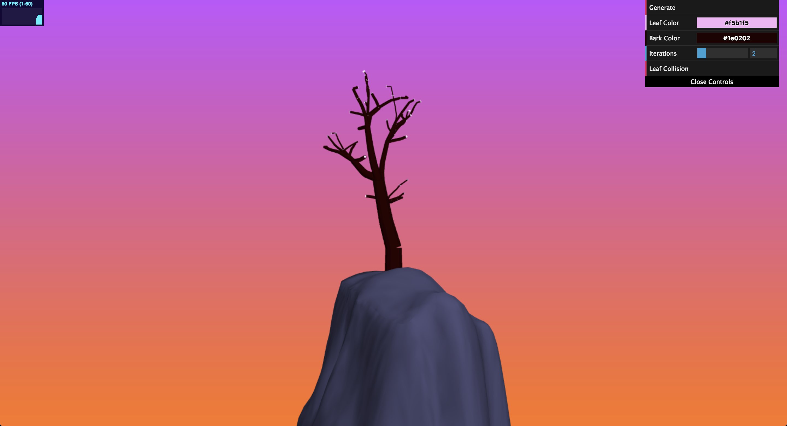
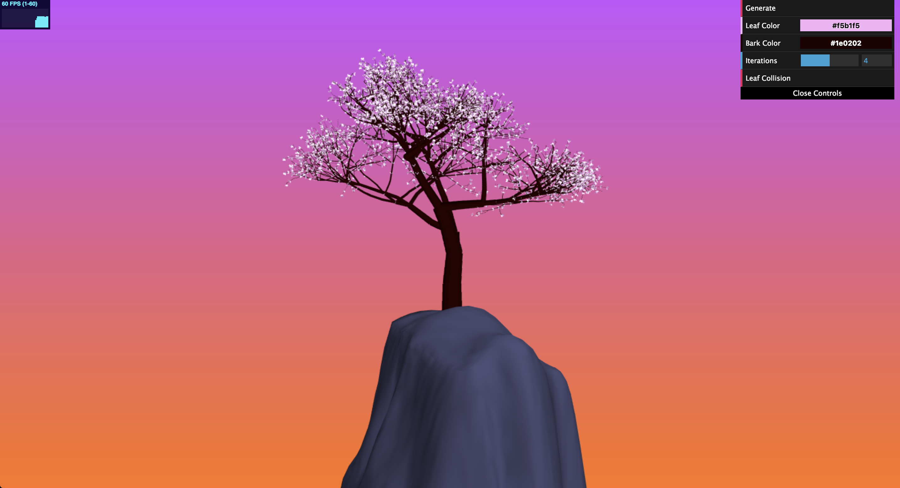
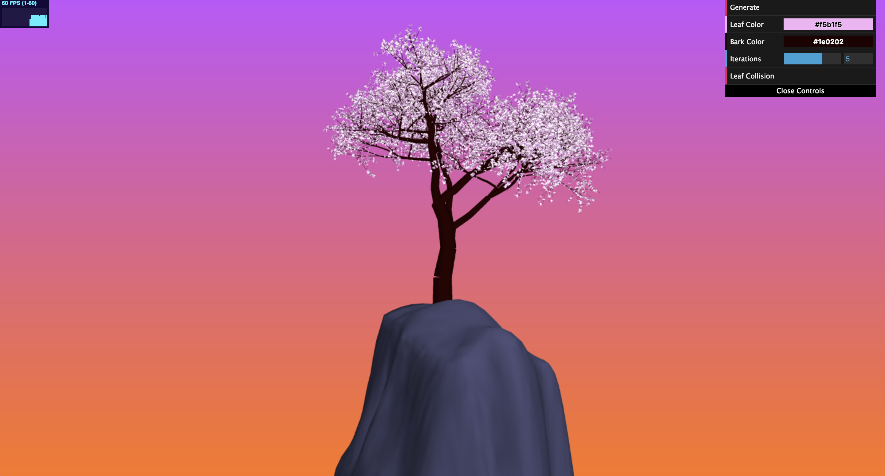
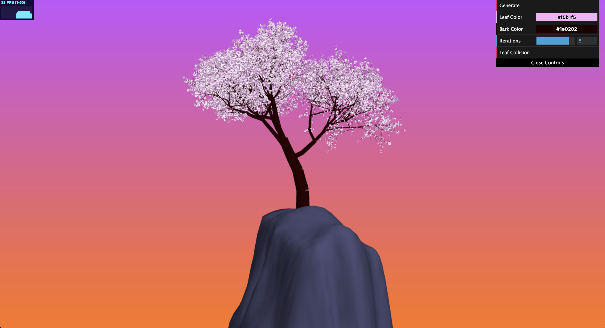
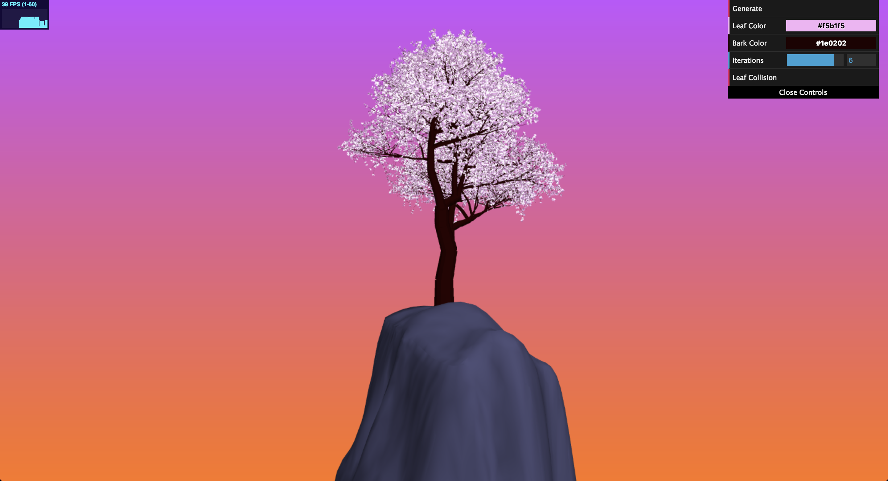
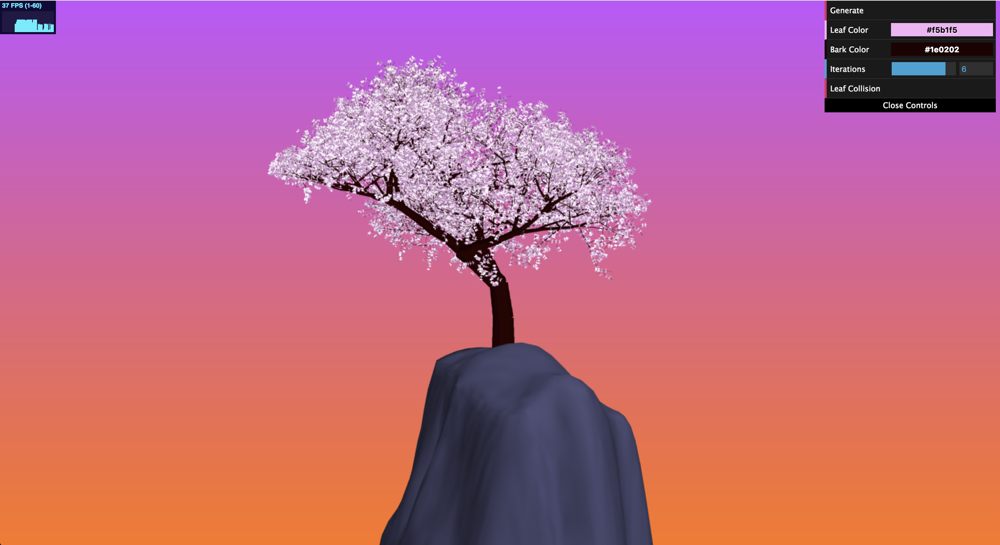
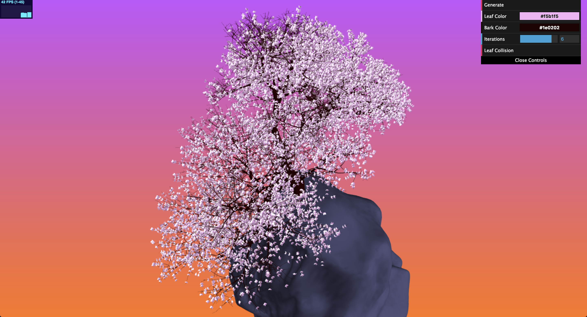
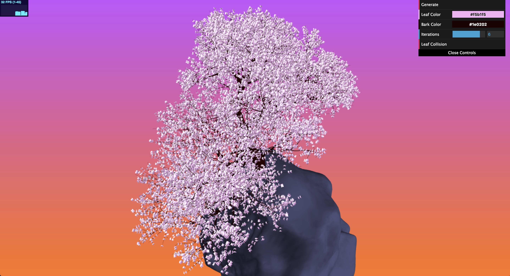

# Homework 4: L-systems

# Cherry Blossom

For this project, I decided to model a cherry blossom as I really like their   aethetic and colors.

# Demo Link

https://ishanranade.github.io/homework-4-l-systems-IshanRanade/

# Technical Details

## L-System

For the L-System I used a linked link class to generate the grammar string, so that I did not have to create a new string for every iteration.  I also modeled the L-System so that the tree would start off with a few trunk branches before beginning to split off into flower branches.

The axiom that I used was:\
"FFFF+FFFF+[X]FFFFF+X"

And the grammar rule that I used was: \
X -> FFF*[+FFF+FFF+FF+FF*X[X[X]]FFFF-FF*X][-FFF+F+FF*X[X[X]]]

These are the rules for each shape:

F -> Scale down by a small amount, rotate around a random axis, draw the branch to the VBO, and then move the Turtle to the next location.  I also had a check to make sure the branches of lower iterations would not start pointing downwards or the tree would look very bizarre.  I did allow branches to start pointing downwards when the branches became very small to make the bushy look at the top of the tree where the cherry blossoms are.

] -> Push a new Turtle onto the stack that is slightly scaled down.

[ -> Pop off the previous Turtle on the stack.

\+ -> Rotate up to 30 degrees around both the tangent and bitangent to the current aim vector.

\- -> Rotate up to 360 degrees around both the tangent and bitangent to the current aim vector.

\* -> Draw a flower.  First check to see the scale of the branch to make sure this flower will even be visible to human eyes.  If the collision check is on, then also test with the kd tree to make sure that no flower is too close to this flower.  The collision check is described at the bottom of the readme.

## Seed

I used a random generator caled seedrandom from https://www.npmjs.com/package/seedrandom that created random values based off a starting seed.  This allows a refreshing of the page to create the same tree every time.  And when you hit the Generate button, the seed is increment and you will produce a new tree with each hit of the button.

## Instancing

I heavily utilized instancing to increase the performance of the application. I found that with adding the same vertices of a mesh to a VBO for every instance of a geometry that I wanted with only modified affine attributes was a big performance waste. It took a long time to calculate the transformation matrices and then apply them to every vertex, and all of this on the CPU side. I found that instancing made this much faster as it only loads up the vertices of a mesh into a VBO once, and then sends a transformation matrix to the shaders for each instance of the geometry so the transformations can be applied on the GPU. This gave me a huge performance boost, especially relative to the large number of geometries in my scene.  All the flowers are instanced from the same mesh as well as the branches.  The rock is the only non instanced mesh.

# Examples

Here are a few examples of generated trees with different iterations with the default seed.

Two Iterations

Four iterations

Five iterations

Six iterations

Here are a few examples of trees generated with different seeds, both with six iterations.  The seed can be changed by continuously hitting the Generate button.

# GUI

The GUI contains the following elements:

- Generate: A button that will create a new L-System with a new seed.  If you refresh the page the seed will reset and you will get the starting tree again.  But if you keep hitting Generate you will keep seeing new tree structures.

- Leaf Color: A color drop down that can be used to set the colors of the flowers.  Be sure to hit Generate again or you will not see your changes.

- Bark Color: A color drop down that can be used to set the color of the branches of the tree.  Be sure to hit Generate again or you will not see your changes.

- Iterations: The number of iterations to use for the L-System.  The flowers will only become apparent around iterations 4-7.  You can start from iteration 1 to see how the tree grows from a small seedling to a large cherry blossom.  Be sure to hit Generate again or you will not see your changes.

- Leaf Collision: A button that will reduce the number of flowers by testing for collisions and removing colliding flowers.  Again, be sure to hit Generate again or you will not see your changes.

# Background

The background is a simple gradient along a quad that is meant to look like a stylized sunset.

# Extra Credit

Collisions Detection On

Collisions Detection Off

For extra credit I implemented collision detection on the flowers to reduce the number of drawn flowers.  For this I used a kd tree, using the npm package k-d-tree from https://www.npmjs.com/package/k-d-tree.  The kdtree accepts a distance function that it uses to test for the nearest neighbor, and for this function I used a distance function from the center of one flower to another.  If the nearest neighbor returned a value smaller than the radius of a flower, then I did not draw the flower.  Each time I did decide to draw a flower, I added the flower's data to the kdtree to be used later.  This reduces the number of cherry blossoms that will end up on the final model and gives a slight performance boost as well.  This feature can be toggled with the Leaf Collision button on the GUI.
